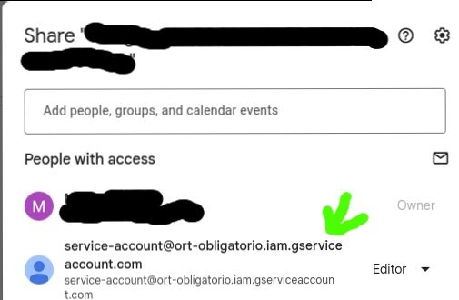

# gen-doc.js

gen-doc.js can be invoked as is without any requirements.

`./gen-doc.js`

## gen-doc-g.js

`gen-doc-g.js` is inteded to be used in together with a with a `GOOGLE_DOC_ID` variable. It can be set in a `.env` file, or otheriwse passed prefixed to the script execution (`GOOGLE_DOC_ID=id ./gen-doc-g.js`)

It is also necessary for you to place a file called `key.json`, which you can get from the Google Cloud Console (https://console.cloud.google.com/iam-admin/serviceaccounts/create?project=YOUR_PROJECT_ID). Don't forget sharing access (Editor) to the document with the service account you create.

in case you get index errors, play around with the variable `batchSize`, the error happens because google batches your requests on its end without fixing the index to write (200 IQ Google Engineers!!!!111!!)
